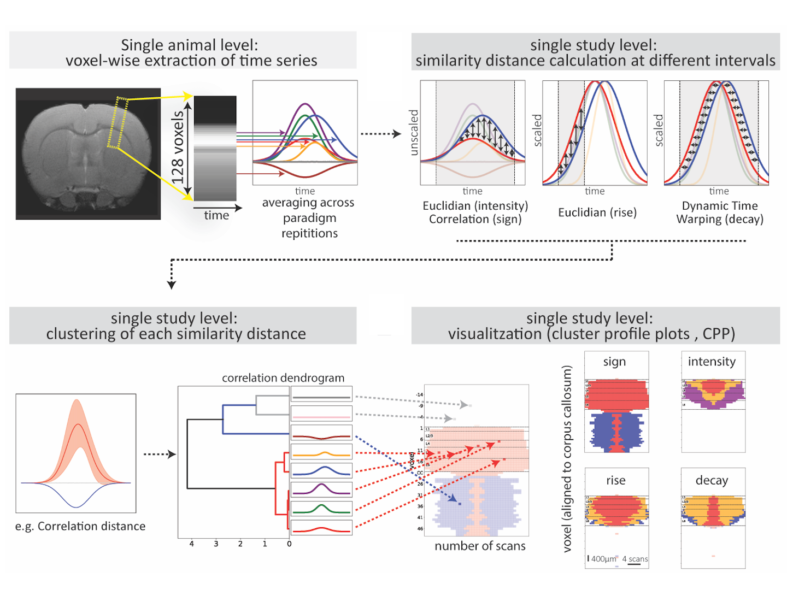

# fMRI Clustering

This repository features Python code designed 
to perform data-driven analysis of sensory 
cortical processing, as detailed in the 
research paper titled "Data-driven signal analysis 
of sensory cortical processing using high-resolution 
fMRI across different studies", 
available for review here.

<p align="center">

</p>

## Tutorials

We offer a suite of analytical workflows specifically 
designed for data-driven examination of fMRI data. 
These workflows are demonstrated in notebooks that 
employ simulated data as examples. Currently, the 
repository encompasses the following types of analyses:
1. Line-Scanning - Amplitude (Correlation-based)
2. Line-Scanning - Amplitude (Euclidean-based)
3. Line-Scanning - Rise (Euclidean-based)
4. Slice - Amplitude (Correlation-based)
5. Slice - Amplitude (Euclidean-based)
6. Slice - Rise (Euclidean-based)

To accurately replicate the results presented in the paper, 
please submit a request for the data via email.

## Citation

```
@article{Plagwitz23DDSA,
  author = {Lucas Plagwitz, Sangcheon Choi, Xin Yu, Daniel Segelcke, Esther Pogatzki-Zahn, Julian Varghese, Cornelius Faber, Bruno Pradier},
  title = {Data-driven signal analysis 
of sensory cortical processing using high-resolution 
fMRI across different studies},
  doi = {https://doi.org/10.1101/2023.08.01.551587}
  year = {2023},
}
```